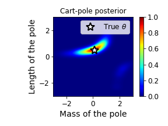
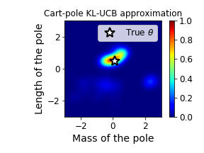
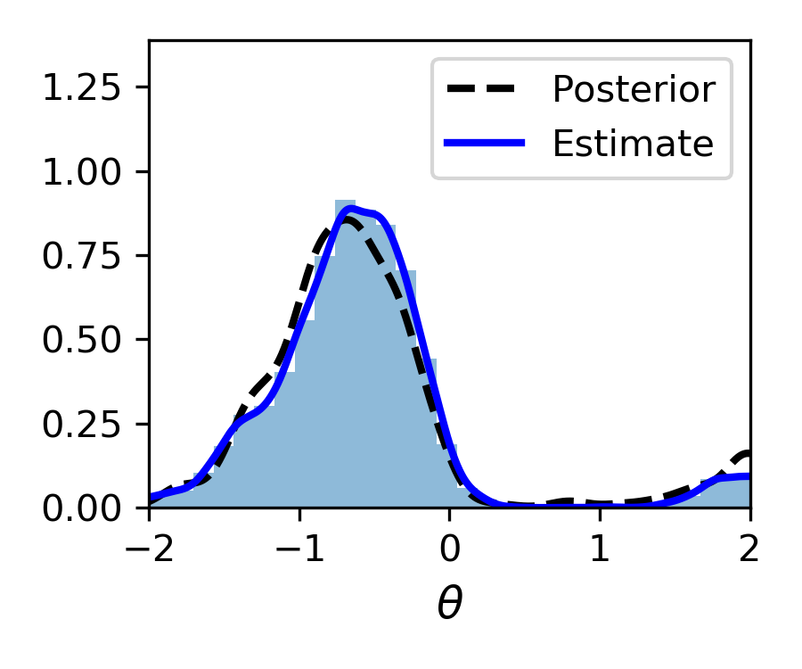
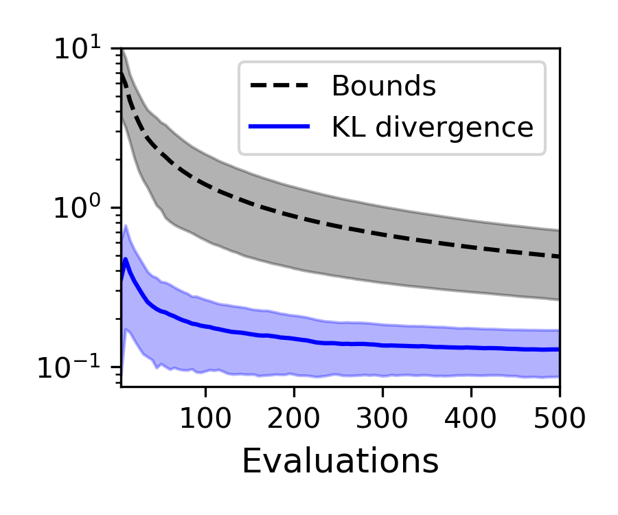
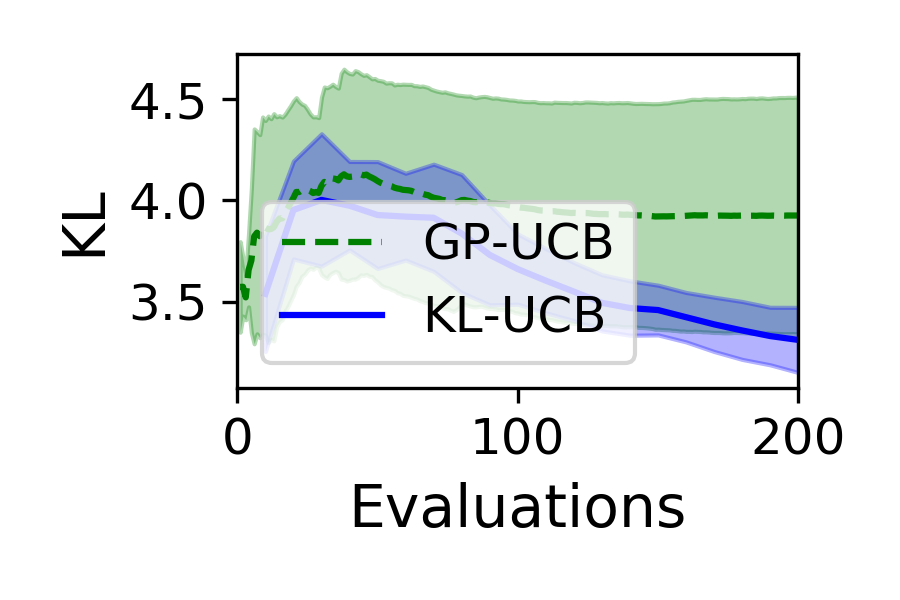

# No-Regret Approximate Inference via Bayesian Optimisation
This repository provides code for the KL-UCB algorithm
and scripts to reproduce experiment results in the paper published at
the 37th conference on Uncertainty in Artificial Intelligence (UAI 2021). The
paper can be found at: https://proceedings.mlr.press/v161/oliveira21a

<table>
 <tr>
  <td></td>
  <td></td>
 </tr>
</table>

## Requirements
The code is based on Python 3.7, and it was run on a Ubuntu/Linux machine. To run the code, we recommend creating a Python 3.7 virtual environment, with e.g.
 Anaconda or `virtualenv`, and then installing the requirements within the virtual environment with:

```setup
pip install -r requirements.txt
```

In addition, the experiment scripts also require third-party code from the
[ITE package](https://bitbucket.org/szzoli/ite-in-python/), provided under `third_party/`,
which needs to be installed separately
(e.g., by running `pip install -e .` under the package's main directory `third_party/ite-in-python`). 

## Experiments
Experiment scripts are found in the main directory. Command-line options for each script can be listed via the `--help` option.
All scripts allow specifying the number of repetitions and iterations 
and setting the output directory. By default, results are recorded under `experiments/`
with a directory name formed by a script-dependent prefix followed by a timestamp suffix.
**Note:** The experimental data, including the computed performance scores, obtained to plot the results in the paper has also been provided as PyTorch files under `experiments/`. However, we describe below the steps for reproduction.

### Toy experiment
You can run the toy experiment in the paper with:
```shell script
python toy_experiment.py
```

### VBMC comparisons
Comparisons against the variational Bayesian Monte Carlo (VBMC) framework by Acerbi (2018)
were run using MATLAB code provided by the original author at: https://github.com/lacerbi/vbmc. 
However, settings were adjusted to turn off post-processing steps in order to provide a fair comparison of the
basic approach against KL-UCB, which runs no post-processing nor automated fine-tuning steps by default. 
MATLAB scripts to run the experiments is provided under `vbmc/`.
The results obtained by running VBMC under these conditions are provided in:
- `experiments/uai2021_vbmc_experiments_circle` for the circular likelihood;
- and `experiments/uai2021_vbmc_experiments_lumpy` for the "lumpy" likelihood.


### Likelihood-free inference
The likelihood-free inference experiments on inferring the mass and length of the pole
in the classic cart-pole reinforcement learning environment (by OpenAI Gym) can be run with:
- `lfi_experiment.py` to run KL-UCB
- `bolfi_experiment.py` to run GP-UCB (BOLFI approach).

The ABC rejection sampling posterior samples were generated with the `abc.ipynb` script,
and the samples are available in a pickle file: `ABC-result-CartPole-Gaussian-prior.pkl` in `experiments/`.

## Plots
A Jupyter notebook `analysis.ipynb` is provided with code to plot the experiment results in the paper.
The notebook loads the provided raw output files in `experiments/`.

<table>
 <tr>
  <td>Objective (Posterior distribution)</td>
  <td>Regret (KL divergence)</td>
 </tr>
 <tr>
  <td></td>
  <td></td>
 </tr>
 <tr>
  <td></td>
  <td></td>
 </tr>
</table>

## Citations
In APA format, the paper can be cited as:

Oliveira, R., Ott, L. &amp; Ramos, F.. (2021). No-regret approximate inference via Bayesian optimisation. <i>Proceedings of the Thirty-Seventh Conference on Uncertainty in Artificial Intelligence</i>, in <i>Proceedings of Machine Learning Research</i> 161:2082-2092 Available from https://proceedings.mlr.press/v161/oliveira21a.html.


To cite the paper in Latex, you can use BibTex:
```bibtex

@InProceedings{pmlr-v161-oliveira21a,
  title = 	 {No-regret approximate inference via Bayesian optimisation},
  author =       {Oliveira, Rafael and Ott, Lionel and Ramos, Fabio},
  booktitle = 	 {Proceedings of the Thirty-Seventh Conference on Uncertainty in Artificial Intelligence},
  pages = 	 {2082--2092},
  year = 	 {2021},
  editor = 	 {de Campos, Cassio and Maathuis, Marloes H.},
  volume = 	 {161},
  series = 	 {Proceedings of Machine Learning Research},
  month = 	 {27--30 Jul},
  publisher =    {PMLR},
  pdf = 	 {https://proceedings.mlr.press/v161/oliveira21a/oliveira21a.pdf},
  url = 	 {https://proceedings.mlr.press/v161/oliveira21a.html},
  abstract = 	 {We consider Bayesian inference problems where the likelihood function is either expensive to evaluate or only available via noisy estimates. This setting encompasses application scenarios involving, for example, large datasets or models whose likelihood evaluations require expensive simulations. We formulate this problem within a Bayesian optimisation framework over a space of probability distributions and derive an upper confidence bound (UCB) algorithm to propose non-parametric distribution candidates. The algorithm is designed to minimise regret, which is defined as the Kullback-Leibler divergence with respect to the true posterior in this case. Equipped with a Gaussian process surrogate model, we show that the resulting UCB algorithm achieves asymptotically no regret. The method can be easily implemented as a batch Bayesian optimisation algorithm whose point evaluations are selected via Markov chain Monte Carlo. Experimental results demonstrate the method’s performance on inference problems.}
}

```
